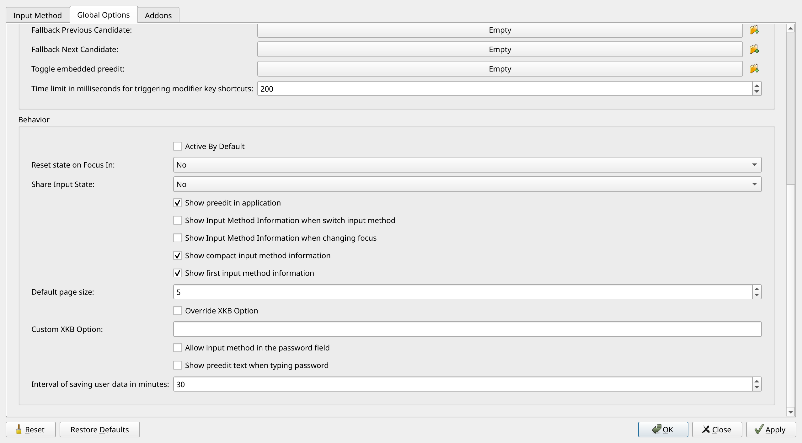

# Korean

Korean input method on `Arch` and `Ubuntu` Linux with [fcitx5](https://github.com/fcitx/fcitx5).

## Table of Contents

- [Install](#install)
- [Environment Variables](#environment-variables)
- [Config](#config)
- [Autostart](#autostart)
  - [Hyprland](#hyprland)
  - [i3](#i3)

---

## Install

- `Arch`

```sh
yay -S fcitx5-im fcitx5-hangul fcitx5-configtool

# recommended fonts for browser
sudo pacman -S adobe-source-han-sans-kr-fonts adobe-source-han-serif-kr-fonts
```

- `Ubuntu`

```sh
sudo apt install fcitx5 fcitx5-hangul fcitx5-configtool

sudo apt install fonts-noto-cjk
```

---

## Environment Variables

Inside `.profile` or `.zprofile`:

- `Arch`

```sh
export GLFW_IM_MODULE=fcitx
export GTK_IM_MODULE=wayland
export QT_IM_MODULE=wayland
export SDL_IM_MODULE=fcitx
export XMODIFIERS=@im=fcitx
```

- `Ubuntu`

```sh
export XMODIFIERS=@im=fcitx
export INPUT_METHOD=fcitx
export GTK_IM_MODULE=fcitx
export QT_IM_MODULE=fcitx
```

---

## Config

### Launch

- Arch: `fcitx5-configtool`
- Ubuntu: `fcitx5-config-qt`

### Input Method Tab

- Add `Hangul` to the **Current Input Method** list.

### Global Options Tab

- Set `Trigger Input Method` to **Right Alt (R_Alt)**
- Disable `Show Input Method Information when switch input method`.



---

## Autostart

### Hyprland

Inside `~/.config/hyprland` at `autostart` module:

```lua
hl.on('hyprland.start', function()
    -- ...
    hl.exec_cmd('fcitx5 -d')
    -- ...
end)
```

### i3

Inside `~/.config/i3/config` file:

```conf
exec_always --no-startup-id fcitx5 -d
```
